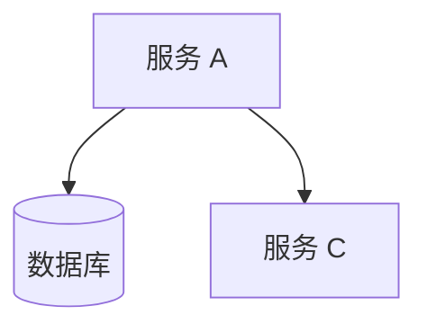
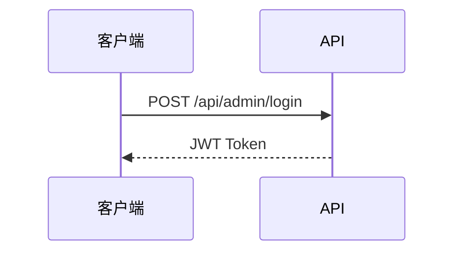
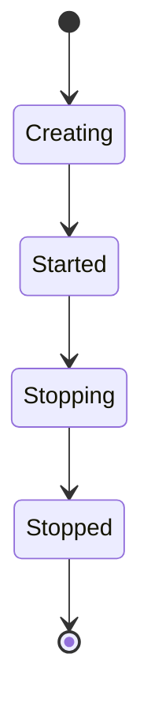
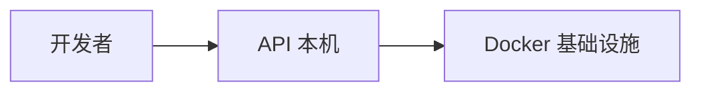

# CLAUDE.md

This file provides guidance to Claude Code (claude.ai/code) when working with code in this repository.

## 项目概述

**Daytona Lite** 是 [Daytona](https://github.com/daytonaio/daytona) 的精简私有化部署版本，移除了 SaaS 相关组件（计费、审计日志、Webhook、邮件、实时通知、CLI、文档站点等），保留核心的 Sandbox 管理能力，并将认证方式从 OIDC/Dex 改为 Admin Password + API Key 双模式。

## 常用命令

### 安装依赖

```bash
yarn install
```

### 本地开发

```bash
# 启动基础设施（数据库、缓存、存储）
docker-compose -f docker/docker-compose.yaml up -d db redis minio registry

# 启动 API 开发服务器（apps/api 目录下）
cd apps/api && yarn start:dev

# 启动 Dashboard 开发服务器（apps/dashboard 目录下）
cd apps/dashboard && yarn dev
```

### 构建

```bash
# 开发构建（所有项目）
yarn build

# 生产构建
yarn build:production

# 单独构建某个应用（如 API）
npx nx build api
```

### 代码检查

```bash
# TypeScript lint
yarn lint:ts

# Python lint
yarn lint:py

# 全部 lint
yarn lint

# 自动修复
yarn lint:fix
```

### 格式化

```bash
# 格式化所有文件
yarn format

# 仅格式化 Python
yarn format:py
```

### 测试

```bash
# 运行所有测试
npx nx run-many --target=test --all

# 运行单个项目的测试（如 API）
npx nx test api

# 运行单个测试文件
npx nx test api --testFile=apps/api/src/sandbox/services/sandbox.service.spec.ts
```

### 数据库迁移

```bash
# 生成迁移
yarn migration:generate

# 运行 pre-deploy 迁移
yarn migration:run:pre-deploy

# 运行 post-deploy 迁移
yarn migration:run:post-deploy

# 回滚迁移
yarn migration:revert
```

### 生成 API Client

```bash
yarn generate:api-client
```

### 构建 Docker 镜像

```bash
docker build -t daytona-api     -f apps/api/Dockerfile .
docker build -t daytona-proxy   -f apps/proxy/Dockerfile .
docker build -t daytona-runner  -f apps/runner/Dockerfile .
docker build -t daytona-daemon  -f apps/daemon/Dockerfile .
```

### 部署

```bash
cd docker
export SERVER_IP=$(hostname -I | awk '{print $1}')
docker-compose up -d
```

## 架构说明

### Monorepo 结构

使用 **Nx** 管理 monorepo，包管理器为 **yarn**。

```
apps/
  api/          - NestJS REST API 服务（端口 3000）
  dashboard/    - React 管理 Web UI（与 API 同端口）
  proxy/        - Sandbox 端口代理（端口 4000）
  runner/       - Sandbox 生命周期管理（端口 3003）
  daemon/       - 容器运行时（随 Sandbox 启动）
  snapshot-manager/ - 镜像快照管理
  ssh-gateway/  - SSH 接入网关（端口 2222）
libs/
  api-client/   - TypeScript API Client（自动生成）
  api-client-python/  - Python API Client（自动生成）
  sdk-python/   - Python SDK
  sdk-typescript/ - TypeScript SDK
  runner-api-client/ - Runner API Client
  toolbox-api-client/ - Toolbox API Client
docker/         - Docker Compose 配置
```

### API 服务（apps/api）

基于 **NestJS** 构建，主要模块：

- **AuthModule** - 双模式认证：`AdminAuthStrategy`（JWT，通过 `POST /api/admin/login` 获取）和 `ApiKeyStrategy`（Bearer Token）。`CombinedAuthGuard` 同时尝试两种策略。
- **SandboxModule** - Sandbox 完整生命周期管理（创建/启动/停止/归档/销毁），包含 Manager 层、Action 层、Runner 适配器层、Repository 层
- **OrganizationModule** - 组织管理，含配额管理和资源隔离
- **AdminModule** - 管理员接口（Runner 管理、Sandbox 管理）
- **RegionModule** - 区域管理，支持多区域部署
- **ApiKeyModule** - API Key 的 CRUD 和验证（带 Redis 缓存）
- **ObjectStorageModule** - S3 兼容存储（MinIO）
- **UsageModule** - 资源使用统计

数据库：**PostgreSQL**（TypeORM），缓存：**Redis**（ioredis），对象存储：**MinIO**（S3 兼容）。

迁移文件分 pre-deploy 和 post-deploy 两类，位于 `apps/api/src/migrations/`。

### Dashboard（apps/dashboard）

基于 **React + Vite**，使用：
- **react-router-dom 6** 管理路由（路由定义见 `apps/dashboard/src/App.tsx`）
- **@tanstack/react-query** 管理服务端状态
- **shadcn/ui + Radix UI + Tailwind CSS** 组件库
- **@daytonaio/api-client** 调用 API（由 `apps/dashboard/src/api/apiClient.ts` 封装）
- **MSW（msw）** 在开发环境 mock API

认证流程：Dashboard 通过 `POST /api/admin/login` 获取 JWT token，存储后通过 `CombinedAuthGuard` 鉴权（与 API Key 兼容）。`ConfigProvider` 在启动时读取 `/api/config` 获取运行时配置。

### 认证机制（Lite 版本特有）

原版 Daytona 使用 OIDC/Dex，Lite 版本改为：
- **Admin Password 认证**：`POST /api/admin/login`，验证 `ADMIN_PASSWORD` 环境变量，颁发 HS256 JWT（64h 有效期，secret 使用 `JWT_SECRET` 或 `ENCRYPTION_KEY`）
- **API Key 认证**：`Authorization: Bearer <key>`，通过 `ApiKeyStrategy` 验证，结果缓存在 Redis
- `CombinedAuthGuard` 同时支持两种方式（`['admin-jwt', 'api-key']`）

### API 约定

- HTTP POST → `Create` 或 `Update`
- HTTP DELETE → `Delete`
- HTTP PUT → `Save`
- HTTP GET → `Find` 或 `List`
- Service 方法不在名称中重复模型名（如 `Create` 而非 `CreateSandbox`）

### 与原版 Daytona 的主要差异

| 已移除 | 替代方案 |
|--------|---------|
| OIDC/Dex 认证 | Admin Password + API Key |
| 计费（Stripe） | 无 |
| 审计日志（OpenSearch/Kafka） | 无 |
| Webhook（Svix） | 无 |
| 邮件服务 | 无 |
| WebSocket 通知 | 无 |
| CLI 工具 | 无 |
| ClickHouse 遥测 | 无 |
| 文档站点（Astro） | 无 |

## 关键环境变量

| 变量 | 说明 |
|------|------|
| `ADMIN_PASSWORD` | Dashboard 管理员密码（必须修改） |
| `ENCRYPTION_KEY` | 数据加密密钥，同时用作 JWT secret（32 字节） |
| `ENCRYPTION_SALT` | 加密盐值（16 字节） |
| `SERVER_IP` | 服务器 IP，影响 Dashboard 和 Proxy 访问 |
| `PROXY_API_KEY` | Proxy 内部通信密钥 |
| `DEFAULT_SNAPSHOT` | 默认 Sandbox 镜像 |
| `DEFAULT_RUNNER_*` | Runner 连接配置 |

完整配置见 `apps/api/src/config/configuration.ts`，Docker Compose 配置见 `docker/docker-compose.yaml`。

## 文档规范

### 目录结构

项目文档统一存放于 `docs/` 目录：

| 路径 | 说明 |
|------|------|
| `docs/architecture.md` | 系统架构总览 |
| `docs/development/macos.md` | macOS ARM 开发指南 |

### Markdown 写作规范

- 标题使用 ATX 风格（`#` `##` `###`）
- 代码块注明语言（` ```bash ` ` ```typescript ` 等）
- 表格用于多字段对比
- 内部链接用相对路径

### Mermaid 图表规范

技术文档应包含 Mermaid 图表辅助理解。常用图类型：

**架构拓扑图**（服务关系、数据流）：



**时序图**（请求流程、认证流程）：



**状态机**（Sandbox 生命周期）：



**流程图**（部署流程、开发工作流）：



### 新增文档时

1. 在 `docs/` 适当子目录创建 `.md` 文件
2. 每个文档包含至少一个 Mermaid 图表
3. 在本文件（`CLAUDE.md`）目录表格中注册新文档
4. 在 `README.md` 中酌情添加链接
