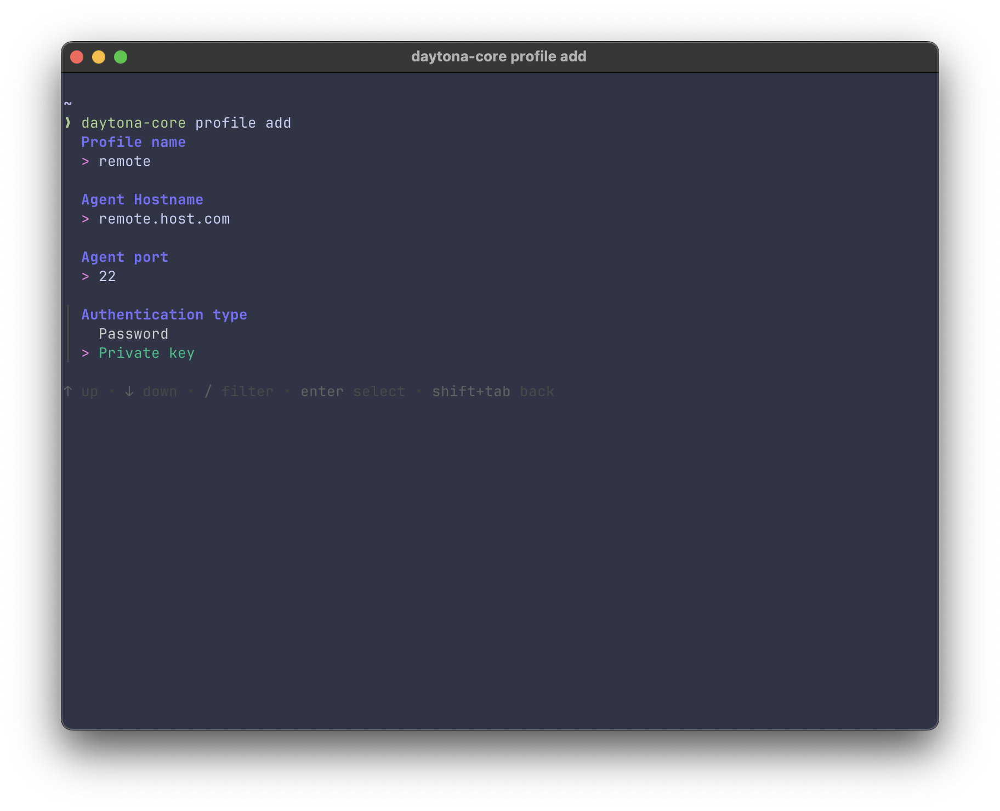
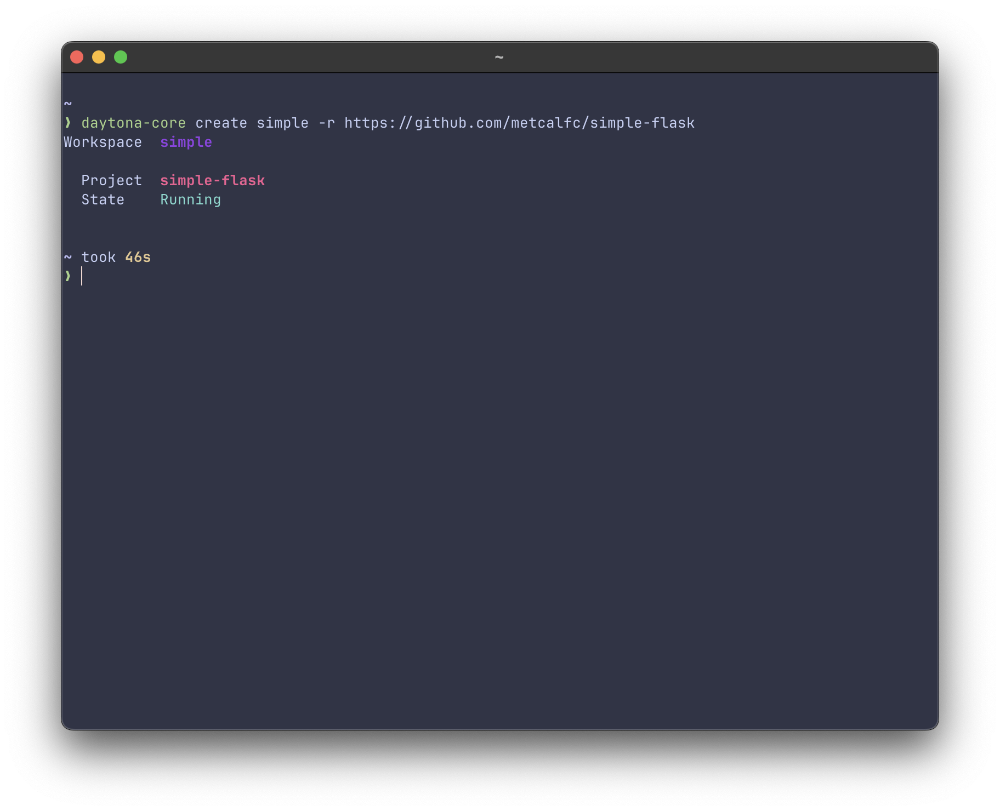
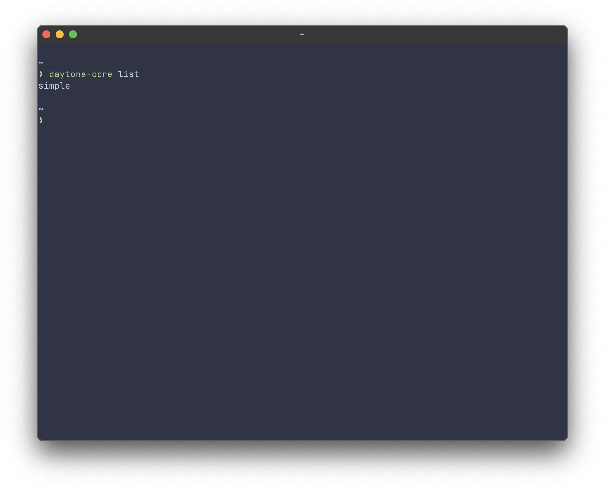
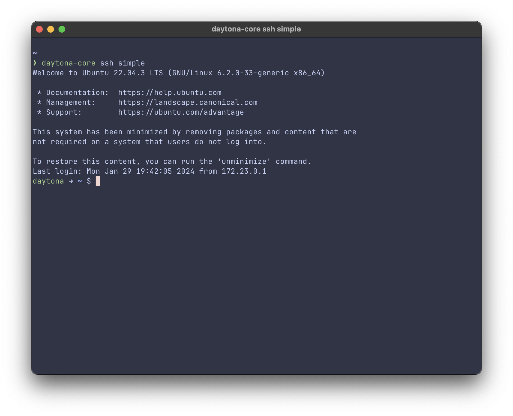

# Instant Local/Remote Development Environments

Daytona Core is a local/remote development environments manager designed for developers. From a single binary, you can create and manage remote development environments, allowing you to focus on your code without the hassle of infrastructure or SaaS.

## TL:DL;

TODO: one liner install

# Table of contents

- [Intro](#intro)
- [Usage](#usage)
- [Plugins](#plugins)
- [Contributing](#contributing)
- [License](#license)

# Intro

[(Back to top)](#table-of-contents)


Daytona Core offers individual developers advantages over other solutions for managing development environments. With Daytona Core, you have an easy and open source solution in a single binary. No Kubernetes clusters to setup and manage. No SaaS accounts or limited free hours to work with.

There are two ways to use Daytona Core. If you have got Docker installed (Docker Desktop or Docker Engine) you can use Daytona Core locally to manage your development environments. This is similar to the experience you get from using the dev container CLI. Except that with Daytona Core, you do not have to specify a dev container file. You can use plain git repositories with any container image.

The second way is to use Daytona Core to manage remote development environments. The only requirement is SSH access to a host that can run Docker. If you have a home lab, Linux VM, or access to a developer friendly cloud like Digital Ocean, Civo, Scaleway, etc this is a great option.

## Features

* Spin-up ready to code development environments (Workspaces) for all popular programming languages
* Multiple repository Workspace configuration suitable for micro-service architecture
* First class devcontainer.json support
* Easy install on remote machines over SSH
* Prebuild hooks for always ready to code environments
* Plugin system for extending the core feature set
* Available plugins for SSH access, VS Code Server, Tailscale

## Read more about how we think about development

* https://www.daytona.io/dotfiles/embracing-standardized-development-environments
* https://www.daytona.io/dotfiles/mastering-development-environment-configuration-standards
* https://www.daytona.io/dotfiles/the-true-cost-of-developer-tools
* https://www.daytona.io/dotfiles/impact-of-development-environments-on-software-creation

# Usage

[(Back to top)](#table-of-contents)

Using Daytona Core is straightforward. You’ll need a Linux host running Docker. This can be local or remote. Here are the commands you will need to get started:

To setup the Daytona:

Start the server with

```
daytona server
```

In a separate shell or on a different machine you can add a profile for that server.

```
daytona profile add
```



To create a new remote development environment, use:

```
daytona create <name> -r <https://github.com/repo/youwant>
```


You can list the running workspaces with:

```
daytona list
```


You can open the workspace in VS Code with:

```
daytona open <name>
```

Or you can SSH to the workspace with:

```
daytona ssh <name>
```



When you are done:
```
daytona delete <name>
```

You can find more detailed documentation here. <INSERT DOCS LINK>

# Plugins

TODO: desc

* SSH Access
* VS Code Server
* Tailscale

# Building

TODO

# Contributing

[(Back to top)](#table-of-contents)

Join our [Slack](https://join.slack.com/t/daytonacommunity/shared_invite/zt-273yohksh-Q5YSB5V7tnQzX2RoTARr7Q) and read [CONTRIBUTING.md](./CONTRIBUTING.md).

## Questions?

You can ask questions, consult with more experienced Daytona users, and discuss development-related topics in our 

# License

[(Back to top)](#table-of-contents)

Daytona Core is licensed under the Apache 2.0 License. See the [LICENSE](./LICENSE) file for more information.

Daytona Core is a product produced from the open source software, exclusively by Daytona, Inc. It is distributed under our commercial terms. Any other distribution, for example, publishing a version of the CLI binary for download, creating a Docker container, running the software as a service, etc. is not allowed. For more information see our trademark policy (https://daytona.io/legal/trademark) 

## Can I build Daytona Core?
You can make a build that includes our trademarks to develop the Daytona Core software itself. You may not publish or share the build, and you may not use that build to run Daytona Core for any other purpose.


