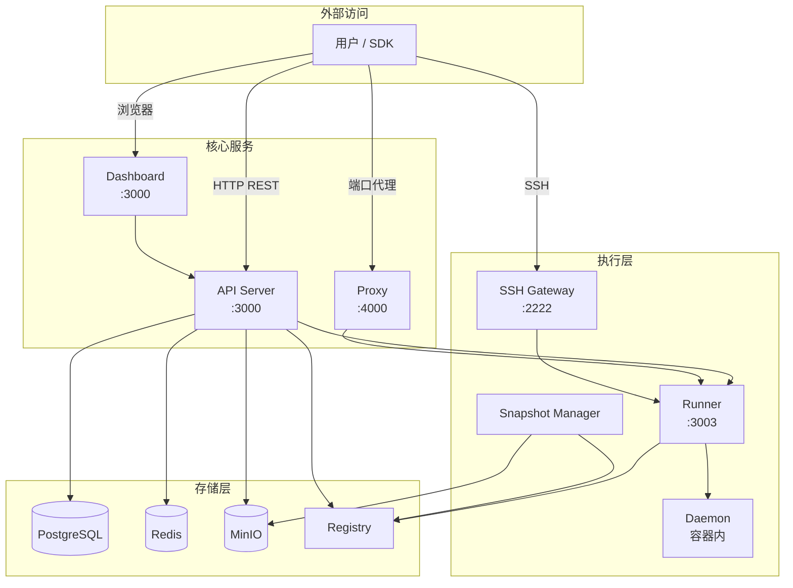

# Daytona Lite

一个精简版的 [Daytona](https://github.com/daytonaio/daytona)，专为私有化部署的 **AI Agent 执行环境** 设计。移除了 SaaS 相关的复杂组件，保留核心的 Sandbox 管理能力。

## 与原版 Daytona 的区别

| 组件 | 原版 Daytona | Daytona Lite |
|------|-------------|--------------|
| 计费系统 | ✅ Stripe 集成 | ❌ 已移除 |
| 审计日志 | ✅ OpenSearch/Kafka | ❌ 已移除 |
| 邮件服务 | ✅ 支持邮件发送 | ❌ 已移除 |
| 实时通知 | ✅ WebSocket 推送 | ❌ 已移除 |
| Webhook | ✅ 支持外部回调 | ❌ 已移除 |
| 组织邀请 | ✅ 多用户协作 | ❌ 已移除 |
| 遥测数据 | ✅ ClickHouse 存储 | ❌ 已移除 |
| CLI 工具 | ✅ 完整命令行工具 | ❌ 已移除 |
| 文档站点 | ✅ 内置文档 | ❌ 已移除 |
| 认证方式 | ✅ OIDC (Dex) | ✅ Admin Password + API Key |
| Dashboard | ✅ 完整功能 | ✅ 保留核心功能 |
| OIDC/Dex 容器 | ✅ 需要 | ❌ 无需（已移除） |

## 系统架构


```mermaid
graph TD
  subgraph external[外部访问]
    user[用户 / SDK]
  end
  subgraph core[核心服务]
    dashboard[Dashboard\n:3000]
    api[API Server\n:3000]
    proxy[Proxy\n:4000]
  end
  subgraph execution[执行层]
    runner[Runner\n:3003]
    daemon[Daemon\n容器内]
    ssh[SSH Gateway\n:2222]
    snapshot[Snapshot Manager]
  end
  subgraph storage[存储层]
    pg[(PostgreSQL)]
    redis[(Redis)]
    minio[(MinIO)]
    registry[Registry]
  end
  user -->|浏览器| dashboard
  user -->|HTTP REST| api
  user -->|SSH| ssh
  user -->|端口代理| proxy
  dashboard --> api
  api --> pg & redis & minio & registry
  api --> runner
  runner --> daemon
  runner --> registry
  proxy --> runner
  ssh --> runner
  snapshot --> registry & minio
```

> 详细架构说明见 [docs/architecture.md](docs/architecture.md)。

## 核心组件

| 服务 | 端口 | 说明 |
|------|------|------|
| `api` | 3000 | REST API 服务，处理所有业务逻辑 |
| `dashboard` | 3000 | Web 管理界面（与 API 同端口） |
| `runner` | 3003 | Sandbox 生命周期管理 |
| `daemon` | - | 容器运行时（随 Sandbox 启动） |
| `snapshot-manager` | - | 镜像快照创建与管理 |
| `ssh-gateway` | 2222 | SSH 接入网关 |
| `proxy` | 4000 | Sandbox 端口代理 |
| `postgres` | 5432 | 元数据存储 |
| `redis` | 6379 | 缓存与消息队列 |
| `minio` | 9000 | S3 兼容对象存储 |

## 认证方式

Daytona Lite 采用**双模式认证**，无需 Dex/OIDC 容器：

| 场景 | 认证方式 | 说明 |
|------|---------|------|
| Dashboard 登录 | Admin Password | 使用 `ADMIN_PASSWORD` 环境变量配置的密码，登录后颁发自签 JWT |
| SDK/API 调用 | API Key | `Authorization: Bearer <api-key>`，从 Dashboard 创建 |
| 内部服务通信 | API Key | Proxy、Runner 等内部服务使用固定 API Key |

## 快速开始

### 前置要求

- Docker 24.0+
- Docker Compose 2.0+
- 4+ CPU 核心
- 8GB+ 内存
- 50GB+ 磁盘空间

### 启动服务

```bash
cd docker

# 设置服务器 IP（局域网访问时必须设置）
export SERVER_IP=$(hostname -I | awk '{print $1}')

# 启动所有服务
docker-compose up -d

# 查看服务状态
docker-compose ps
```

### 访问 Dashboard

1. 打开浏览器，访问 `http://localhost:3000/dashboard`
2. 在登录页面输入管理员密码（默认：`docker-compose.yaml` 中 `ADMIN_PASSWORD` 的值）
3. 登录成功后即可管理 Sandbox、查看资源、创建 API Key

> **注意**：首次部署请修改 `docker-compose.yaml` 中的 `ADMIN_PASSWORD` 为强密码。

### 创建 API Key

登录 Dashboard 后，进入 **Keys** 页面创建 API Key，用于 SDK 和程序化调用。

也可以通过管理员 JWT 直接调用：

```bash
# 1. 登录获取 JWT
TOKEN=$(curl -s -X POST http://localhost:3000/api/admin/login \
  -H "Content-Type: application/json" \
  -d '{"password":"your-admin-password"}' | jq -r .token)

# 2. 创建 API Key
curl -X POST http://localhost:3000/api/organizations/{org-id}/api-keys \
  -H "Authorization: Bearer $TOKEN" \
  -H "Content-Type: application/json" \
  -d '{"name": "my-key"}'
```

### 使用 SDK

**Python SDK:**

```bash
pip install daytona
```

```python
from daytona import Daytona, DaytonaConfig

daytona = Daytona(DaytonaConfig(
    api_key="YOUR_API_KEY",
    base_url="http://localhost:3000"
))

# 创建 Sandbox
sandbox = daytona.create({"language": "python"})

# 执行代码
response = sandbox.process.code_run('''
import sys
print(f"Python {sys.version}")
print("Hello from Daytona!")
''')

print(response.result)

# 清理
daytona.delete(sandbox)
```

**TypeScript SDK:**

```bash
npm install @daytonaio/sdk
```

```typescript
import { Daytona } from '@daytonaio/sdk'

const daytona = new Daytona({
  apiKey: 'YOUR_API_KEY',
  baseUrl: 'http://localhost:3000'
})

const sandbox = await daytona.create({ language: 'typescript' })

const response = await sandbox.process.codeRun(`
  console.log('Hello from Daytona!')
`)

console.log(response.result)

await daytona.delete(sandbox)
```

**直接使用 REST API:**

```bash
# 创建 Sandbox
curl -X POST http://localhost:3000/api/sandboxes \
  -H "Authorization: Bearer YOUR_API_KEY" \
  -H "Content-Type: application/json" \
  -d '{"language": "python", "resources": {"cpu": 1, "memory": 2, "disk": 10}}'

# 执行命令
curl -X POST http://localhost:3000/api/sandboxes/{id}/toolbox/process/execute \
  -H "Authorization: Bearer YOUR_API_KEY" \
  -H "Content-Type: application/json" \
  -d '{"command": "echo Hello", "timeout": 30}'
```

## 配置说明

### 关键环境变量

| 变量 | 默认值 | 说明 |
|------|--------|------|
| `ADMIN_PASSWORD` | `changeme` | Dashboard 管理员登录密码（**务必修改**） |
| `ENCRYPTION_KEY` | `supersecretkey` | 敏感数据加密密钥（**务必修改**，建议 32 字节） |
| `ENCRYPTION_SALT` | `supersecretsalt` | 加密盐值（**务必修改**，建议 16 字节） |
| `SERVER_IP` | `localhost` | 服务器公网/局域网 IP，影响 Dashboard 和 Proxy 访问 |
| `DEFAULT_SNAPSHOT` | `daytonaio/sandbox:0.5.0-slim` | 默认 Sandbox 镜像 |
| `PROXY_API_KEY` | `super_secret_key` | Proxy 内部通信密钥（**务必修改**） |

### 资源配额

默认配额（可在 `docker-compose.yaml` 中修改）：

```yaml
- DEFAULT_ORG_QUOTA_TOTAL_CPU_QUOTA=10000    # 总 CPU 配额（毫核）
- DEFAULT_ORG_QUOTA_TOTAL_MEMORY_QUOTA=10000  # 总内存配额（MB）
- DEFAULT_ORG_QUOTA_TOTAL_DISK_QUOTA=100000   # 总磁盘配额（MB）
- DEFAULT_ORG_QUOTA_MAX_CPU_PER_SANDBOX=100   # 每个 Sandbox 最大 CPU
- DEFAULT_ORG_QUOTA_MAX_MEMORY_PER_SANDBOX=100 # 每个 Sandbox 最大内存（MB）
```

## 功能特性

### 支持的运行时

| 语言 | 镜像标签 |
|------|----------|
| Python | `daytonaio/sandbox:0.5.0-python` |
| TypeScript/Node.js | `daytonaio/sandbox:0.5.0-typescript` |
| Go | `daytonaio/sandbox:0.5.0-go` |
| Java | `daytonaio/sandbox:0.5.0-java` |
| PHP | `daytonaio/sandbox:0.5.0-php` |
| Ruby | `daytonaio/sandbox:0.5.0-ruby` |
| 通用（精简） | `daytonaio/sandbox:0.5.0-slim` |

### API 能力

- **文件系统**: 读写文件、目录列表、文件上传下载
- **进程执行**: 代码执行、命令运行、PTY 终端
- **Git 操作**: Clone、Commit、Branch 管理
- **LSP 支持**: 代码补全、定义跳转、诊断
- **端口代理**: 内网穿透访问 Sandbox 服务
- **VNC 访问**: 图形界面远程控制
- **SSH 接入**: 直接 SSH 连接到 Sandbox

## 生产部署建议

### 1. 安全配置（必须修改）

```yaml
# docker-compose.yaml
api:
  environment:
    - ADMIN_PASSWORD=<强密码>
    - ENCRYPTION_KEY=<32字节随机字符串>
    - ENCRYPTION_SALT=<16字节随机字符串>
    - PROXY_API_KEY=<随机字符串>
```

生成随机密钥：
```bash
# Admin 密码
openssl rand -base64 24

# 加密密钥（32 字节 hex）
openssl rand -hex 32

# 加密盐值（16 字节 hex）
openssl rand -hex 16
```

### 2. 持久化存储

```yaml
# 确保使用命名卷（docker-compose.yaml 中已配置）
volumes:
  db_data:
  minio_data:
  registry:
```

### 3. 资源限制

```yaml
runner:
  deploy:
    resources:
      limits:
        cpus: '8'
        memory: 32G
```

### 4. 反向代理配置（Nginx）

```nginx
server {
    listen 443 ssl;
    server_name daytona.yourcompany.com;

    ssl_certificate /path/to/cert.pem;
    ssl_certificate_key /path/to/key.pem;

    # API + Dashboard
    location / {
        proxy_pass http://localhost:3000;
        proxy_set_header Host $host;
        proxy_set_header X-Real-IP $remote_addr;
        proxy_set_header X-Forwarded-For $proxy_add_x_forwarded_for;
        proxy_set_header X-Forwarded-Proto $scheme;
    }

    # WebSocket 支持（用于实时日志和 VNC）
    location ~ ^/api/sandboxes/ {
        proxy_pass http://localhost:3000;
        proxy_http_version 1.1;
        proxy_set_header Upgrade $http_upgrade;
        proxy_set_header Connection "upgrade";
        proxy_read_timeout 3600s;
    }
}

# Proxy 服务（Sandbox 端口访问）
server {
    listen 443 ssl;
    server_name *.proxy.yourcompany.com;

    ssl_certificate /path/to/cert.pem;
    ssl_certificate_key /path/to/key.pem;

    location / {
        proxy_pass http://localhost:4000;
        proxy_set_header Host $host;
        proxy_http_version 1.1;
        proxy_set_header Upgrade $http_upgrade;
        proxy_set_header Connection "upgrade";
    }
}
```

## 开发指南

### macOS ARM 开发

在 Apple Silicon Mac 上开发时，API 和 Dashboard 可原生运行，Runner 需通过 Docker Desktop 容器化运行。

详见 **[docs/development/macos.md](docs/development/macos.md)**。

### 本地开发

```bash
# 1. 安装依赖
yarn install

# 2. 启动开发基础设施（db/redis/minio/registry/runner）
yarn dev:start

# 3. 启动 API（热重载）
yarn dev:api

# 4. 启动 Dashboard（Vite）
yarn dev:dashboard
```

常用开发命令：

```bash
# 一键启动基础设施 + API + Dashboard
yarn dev:full

# 查看容器状态/日志
yarn dev:status
yarn dev:logs

# 停止开发基础设施
yarn dev:stop

# 环境诊断
yarn dev:doctor
```

`yarn dev:full` 一键模式包含以下自动处理：
- 自动读取 `apps/api/.env` 并将 `DEFAULT_RUNNER_API_KEY` 注入到开发容器，避免 Runner 与 API token 不一致。
- 若 `.env` 中配置的数据库不存在（例如 `application_ctx`），会自动在本地 PostgreSQL 容器中创建。
- 自动将不适合宿主机开发的地址做本地化兜底（如 `db/redis/minio/otel-collector`）。
- 自动将镜像仓库地址规范到 `host.docker.internal:6000`，保证宿主机 API 与容器内 Runner 都可访问。

首次启动时，Dashboard 可能短暂出现 `/api/config ECONNREFUSED`（API 仍在编译启动），通常会在 API 就绪后自动恢复。

双模式说明：
- 轻量模式（推荐）：`docker/docker-compose.dev.yml` + 本机 API/Dashboard 热更新
- 全容器模式：`docker/docker-compose.yaml`（用于完整集成验证）

### 构建 Docker 镜像

```bash
# 构建所有服务镜像
docker build -t daytona-api     -f apps/api/Dockerfile .
docker build -t daytona-proxy   -f apps/proxy/Dockerfile .
docker build -t daytona-runner  -f apps/runner/Dockerfile .
docker build -t daytona-daemon  -f apps/daemon/Dockerfile .
```

## 故障排查

### 查看日志

```bash
# 所有服务日志
docker-compose logs -f

# 特定服务
docker-compose logs -f api
docker-compose logs -f runner
docker-compose logs -f proxy
```

### 常见问题

**Q: Dashboard 登录失败（密码正确但报错）？**
```bash
# 检查 API 是否正常启动
curl http://localhost:3000/api/health

# 检查 ADMIN_PASSWORD 环境变量是否已设置
docker-compose exec api env | grep ADMIN_PASSWORD
```

**Q: Sandbox 创建失败？**
```bash
# 检查 runner 特权模式
docker-compose exec runner docker info

# 检查磁盘空间
docker-compose exec runner df -h

# 查看 runner 日志
docker-compose logs runner
```

**Q: 无法通过 Proxy 访问 Sandbox 端口？**
```bash
# 检查 proxy 服务
curl http://localhost:4000/health

# 确认 SERVER_IP 设置正确
docker-compose exec proxy env | grep SERVER_IP
```

**Q: API Key 认证失败？**
```bash
# 验证 API Key
curl -v http://localhost:3000/api/sandboxes \
  -H "Authorization: Bearer YOUR_API_KEY"

# 检查 Redis 连接
docker-compose exec redis redis-cli ping
```

**Q: 存储空间不足？**
```bash
# 清理已停止的容器和镜像
docker system prune -a

# 查看 MinIO 存储使用量
docker-compose exec minio mc du local/
```

## 许可证

AGPL-3.0 License - 详见 [LICENSE](LICENSE)

## 致谢

本项目基于 [Daytona](https://github.com/daytonaio/daytona) 精简而来，感谢原作者的开源贡献。
