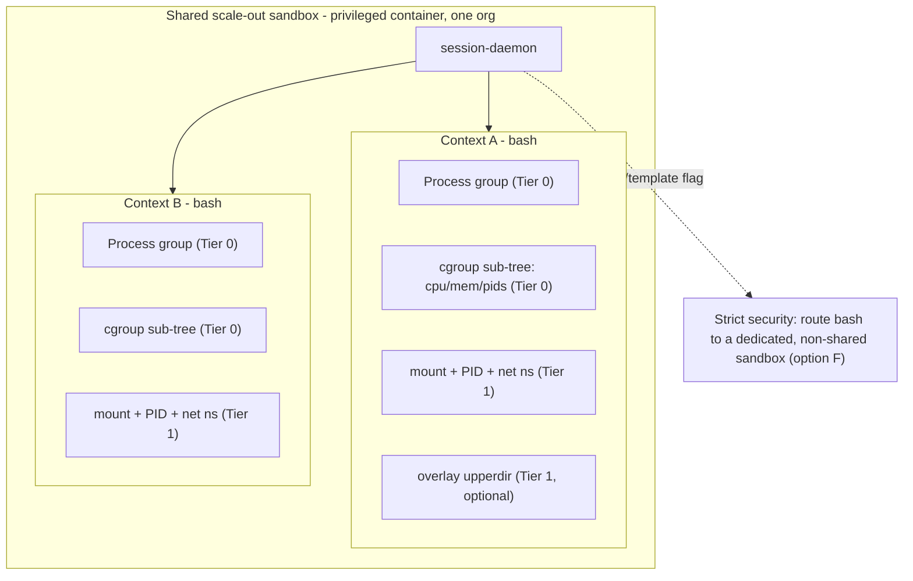

# Bash Isolation Feasibility

Can the session product safely run **isolated bash executions**, where the hard part is isolating
concurrent contexts that share one scale-out sandbox?

This document began as a feasibility/design analysis. **§1–§8 are that original analysis** (kept as
the decision record); **§9 documents what was actually implemented in v1** — the `just-bash` isolate
engine plus the in-isolate (TypeScript) and stdio-RPC (Python) `bash()` bridges. If you only want to
know how bash works today, jump to [§9](#9-implemented-design-v1--just-bash-isolate--bash-bridges).
It is the companion investigation to [scale-out.md](./scale-out.md) and the implementation surfaces
it references live in `apps/session-daemon/internal/` and `apps/api/src/session/`.

## 1. Verdict (TL;DR)

**Yes, it's feasible.** Adding a `bash` worker to the session-daemon is mechanically easy: the
daemon already has a clean `Worker` / `WorkerFactory` extension point, and the existing
`stdout` / `stderr` / `error` / `control` frame protocol fits a shell perfectly. The entire
difficulty is the **isolation requirement**, and the right answer is **tiered**, not
one-size-fits-all:

- **Tier 0 (ship first):** per-context process group + per-context working directory + a per-context
  cgroup v2 sub-tree. Minimal risk; meets or exceeds the isolation Python/TS contexts get today.
- **Tier 1 (the real "isolated bash" target):** add Linux namespaces per context
  (bubblewrap / `unshare`: mount + PID namespaces, private `/tmp`, per-context bind-mounted workdir),
  optionally an overlay filesystem.
- **Strict security escape hatch:** route bash contexts to a **dedicated, non-shared sandbox** so the
  existing container boundary _is_ the isolation. Nested containers / gVisor are documented as a
  future hardened path but rejected as the default (they kill the density the product is built for).
- **Complement, not just build:** existing tools solve adjacent versions of this. A **virtual bash
  interpreter** (`just-bash`, bashkit) gives inter-context isolation by construction for non-binary
  workloads, and microVM products (E2B, Modal, microsandbox) are the reference for full real-bash
  isolation. See §7 for the build-vs-buy survey.

## 2. Threat model (this reframes "safe")

The boundary you are asking to protect determines everything, so state it precisely:

- Scale-out only co-locates contexts of the **same `(organizationId, templateId)`**
  (`session-instance.entity.ts`). So contexts sharing a sandbox are in the **same trust domain — one
  organization**. The requirement is therefore primarily **blast-radius / correctness isolation**:
  one session's `rm -rf`, `kill`, port bind, or leaked background daemon must not clobber a sibling
  session in the same sandbox. It is **not** a hardened cross-tenant security boundary.
- Cross-tenant security still rests on the **Docker container** boundary — and for non-GPU sandboxes
  that container is **privileged** (`Privileged: gpuIndex == nil` in
  `apps/runner/pkg/docker/container_configs.go`). A privileged container is a _weak_ security
  boundary: a determined process can often escape it. So genuinely **untrusted** bash needs option F
  (dedicated sandbox), not in-sandbox namespace tricks layered inside one shared privileged
  container.
- **Baseline reality check:** today's Python and TS contexts already **share `/workspace` and the
  network** and are isolated only at the interpreter level (separate globals / V8 contexts). They
  have no filesystem, PID, or network isolation from each other. "Isolated bash" therefore _raises
  the bar above current behavior_ — reviewers should calibrate "safe" against that fact, not against
  an imagined per-context jail that doesn't exist for the other languages either.

The silver lining: because the privileged container already grants `CAP_SYS_ADMIN`, the in-sandbox
isolation primitives in Tier 1 (mount/PID/net namespaces, overlayfs, cgroup writes) are **available
without adding capabilities** — the same property that makes the container a weak _security_
boundary makes it an easy place to build _correctness_ isolation.

## 3. Where bash plugs in (mechanics)

A bash worker is a new implementation of the existing `Worker` contract
(`apps/session-daemon/internal/interpreter/worker.go`), modeled on the Python subprocess worker
(`python_subprocess.go`):

- A long-lived `bash` (or `sh`) subprocess per context, with a thin wrapper that frames the shell's
  `stdout` / `stderr` and the command exit code into the JSON-line `WorkerChunk` protocol
  (`types.go`). The same chunking the SDK already consumes — no new wire format.
- `reset: true` (already in `ExecuteRequest`) maps cleanly to "start a fresh shell" so the
  transient-slot recycling the one-shot `codeRun` path uses (`session.service.ts`) keeps working
  without leaking shell state between pooled one-shot calls.
- `Interrupt()` sends `SIGINT` to the process **group** (not just the shell PID) so a `sleep`/`curl`
  child actually dies; the manager's existing timeout → interrupt → grace → SIGKILL sequence
  (`session.go`) is reused as-is.
- The manager's FIFO-per-context queue already serializes execs within a context, which matches shell
  semantics (one command at a time per shell).

API-side surface (small):

- Add `SessionLanguage.BASH` to `apps/api/src/session/enums/session-language.enum.ts`.
- Add a `case` in `Manager.factoryFor` (`manager.go`) and a `BashMaxContexts` capacity cap in
  `config.go` / `checkCapacityLocked` (mirroring `PyMaxContexts` / `TSMaxContexts`).
- `codeRun` / `connect` / `createSession` need **no shape changes** — they already route by language.

## 4. Isolation dimensions

A useful bash isolation story has to address each of these independently; an option is only as good
as the weakest dimension it leaves open:

- **Filesystem** — each context should get its own working tree and must not clobber siblings or the
  shared system dirs.
- **Process tree** — context A must not `ps`/`kill` context B's processes; teardown must reap A's
  entire tree (including background `&` jobs and daemonized children).
- **Network / ports** — port binds must not collide; ideally each context has its own loopback.
- **Environment** — per-exec env is already handled (the `envs` map on each exec frame).
- **Resources** — CPU / memory / PIDs / disk caps per context so one runaway bash cannot starve
  siblings _or_ skew the sandbox-wide `/load` saturation signal the scheduler depends on.
- **Lifetime / cleanup** — on context delete, timeout, or sandbox roll, every process, mount, and
  cgroup the context created must be torn down deterministically.

## 5. Isolation options

Each option is scored against this codebase's reality (privileged Docker sandbox, shared
`/workspace`, scale-out co-location within one org, density-oriented daemon worker model).

### A. Process group + per-context cwd only (the parity floor)

Run bash in the shared container, `setpgid` each context's shell, `kill -<pgid>` on teardown, and
give each context its own working directory under `/workspace`.

- **Pros:** trivial; zero new dependencies; matches the isolation Python/TS contexts have today; clean
  reaping of background jobs via the process group.
- **Cons:** filesystem, PID, and network are still **shared** — `rm -rf` outside the context's dir,
  `kill` of a sibling PID, and port collisions all remain possible. Convention, not enforcement.

### B. Linux namespaces per context — bubblewrap / nsjail / raw `unshare` (recommended real isolation)

Wrap each context's shell in its own namespaces:

- **mount ns** — private `/tmp`, a bind-mounted per-context workdir, and (optionally) a read-only view
  of system dirs.
- **PID ns** — `ps` / `kill` see only the context's own tree; killing the namespace's init process
  reaps **all** descendants and background jobs in one shot.
- **net ns** (optional) — isolates port binds; each context gets its own loopback.

- **Pros:** real enforcement of the FS / process / port dimensions; feasible **without extra caps**
  because the container is privileged (`CAP_SYS_ADMIN`). `bubblewrap` gives the cleanest UX; `nsjail`
  bundles rlimits + seccomp + cgroup; raw `unshare --mount --pid --fork` is the zero-dependency route.
- **Cons:** adds a binary to the sandbox image (bwrap/nsjail) or careful `unshare` flag management;
  a net ns that still needs **outbound** connectivity requires veth + NAT plumbing (non-trivial — if
  outbound is needed, consider sharing the container's net ns and isolating ports another way); small
  per-context startup cost.

### C. cgroup v2 sub-tree per context (complements A or B)

Create a delegated cgroup per context (e.g. `.../ctx-<id>`), set `cpu.max` / `memory.max` /
`pids.max`, and place the context's process group in it.

- **Pros:** natural fit — the daemon already reads cgroup v2 for the `/load` endpoint
  (`apps/session-daemon/internal/loadstat/loadstat.go`). Stops one bash from starving siblings and
  from skewing the sandbox-wide pressure signal the scheduler uses. Writable today because the
  container is privileged.
- **Cons:** needs cgroup delegation / a writable cgroupfs mount; per-context cleanup of the cgroup
  directory on teardown.

### D. Overlay / ephemeral filesystem per context (strong FS isolation; requires B's mount ns)

Mount an `overlayfs` with `lowerdir` = a baseline (image rootfs or a `/workspace` seed),
`upperdir` = a per-context directory discarded on delete — a copy-on-write private rootfs view.

- **Pros:** strongest FS isolation; protects both sibling files and shared system dirs; trivially
  reset on context teardown.
- **Cons:** only meaningful inside a mount namespace (so it depends on B); per-context setup cost and
  upper-dir disk usage that counts against the sandbox's disk quota.

### E. Nested container / gVisor `runsc` per context (rejected as default)

Spawn a child container (podman/crun) or a gVisor-sandboxed process per context.

- **Pros:** strongest, closest to a real security boundary; would even hold for untrusted code.
- **Cons:** ~10–100× the footprint of a TS context (which is ~10 MB), which **defeats the
  low-latency, high-density goal** of the session product. Requires nested-container support in a
  privileged container. Overkill for an intra-org boundary. **Keep only as a documented future path**
  for untrusted multi-tenant bash.

### F. Don't share the sandbox for bash (strict-security escape hatch)

Add a scheduler flag so `bash` contexts are placed on a **dedicated, non-co-located** sandbox (cap
one bash context per instance, or pin a fresh instance per context).

- **Pros:** the existing Docker container boundary _is_ the isolation — **zero** new in-sandbox
  machinery; strongest practical boundary short of E; conceptually simple.
- **Cons:** sacrifices scale-out density for bash (≈ one sandbox per bash session), higher cost and
  cold-start latency.

### G. Virtual / emulated bash interpreter (sandbox by reimplementation — `just-bash` model)

Don't run real `bash` at all. Embed a bash interpreter that reimplements commands in a host language
against an **in-memory virtual filesystem**, so there is no `fork`/`exec` and no host FS / PID /
network access unless explicitly granted. This is the approach `just-bash` (Vercel Labs, TypeScript)
and `bashkit` (Rust) take — see §8.

- **Pros:** inter-context isolation **by construction** — each context is its own interpreter
  instance with its own VFS, so siblings cannot see files, processes, or ports because none of those
  are real/shared. Near-zero startup, no per-context OS plumbing, and — since the daemon already runs
  a Node host for TypeScript (`ts_host.go`) — `just-bash` could plug in as a new "language" with the
  isolation problem already solved. Network is opt-in with URL allow-lists.
- **Cons:** it is **not real bash** — it cannot run arbitrary binaries (`pip install`, `git`, project
  build tools, user-installed CLIs) unless they're separately emulated (just-bash offers opt-in
  CPython/QuickJS; bashkit embeds pure-Rust Python/TS). That defeats a primary reason Daytona
  sandboxes exist (running real toolchains). Best treated as a **complement** for "explore data / safe
  text munging" bash, not a replacement for full-fidelity shell access.

## 6. Recommendation (tiered) and rollout

- **Tier 0 — ship first:** options **A + C**. Process-group reaping + per-context cwd + per-context
  cgroup sub-tree. Lowest risk, immediately meets/exceeds the isolation Python/TS contexts have today,
  and wires bash into the existing scale-out load model cleanly.
- **Tier 1 — target:** add **B** (bubblewrap/`unshare`: mount + PID namespaces, private `/tmp`,
  per-context bind workdir) and optionally **D** (overlay). This is the real "isolated bash."
- **Strict security:** expose **F** as a per-org/template option for untrusted bash; document **E** as
  the future hardened path if true cross-tenant bash on a shared host is ever required.
- **Complementary fast path:** consider **G** (a virtual interpreter such as `just-bash`) as a
  separate "safe-bash" language for agent workloads that only need text/data munging — it gives
  perfect inter-context isolation cheaply, while real-bash contexts (A–F) cover full-fidelity needs.
- **Rollout safety:** like scale-out, this can ship dark — gate bash behind a template `languages`
  entry and a capacity cap of 0 by default, then enable per template.

## 7. Prior art and existing solutions (build vs. buy)

This is a well-trodden problem in the AI-agent space; the existing solutions cluster into two
families, and Daytona's session product already sits at a specific point in that landscape (vendor
comparisons consistently classify **Daytona as the "Docker container, shared kernel" tier**, vs
E2B's per-session microVM). That framing matters: the intra-org bash question is precisely about
sub-isolating _within_ that container tier.

**Family 1 — virtual/emulated bash interpreters** (sandbox by reimplementation; map to option G):

- **`just-bash`** (Vercel Labs, TypeScript, Apache-2.0, ~4K stars) — virtual bash + in-memory VFS,
  75+ reimplemented commands (incl. awk/sed/jq), network off-by-default with URL allow-lists, opt-in
  Python (CPython) and JS/TS (QuickJS), execution limits, and a `@vercel/sandbox`-compatible API so
  you can "upgrade" to a real VM later. Per-`exec()` shell state resets; the VFS is shared across
  calls. Because it's TypeScript, it could run inside the daemon's existing Node host.
- **`bashkit`** (Rust) — 156 commands reimplemented with no `fork`/`exec`, in-memory VFS, explicit
  per-instance multi-tenant isolation, embedded pure-Rust Python (Monty) and TS (ZapCode).
- **`bashbox`** (pure PHP) and **`gbash`** (Go; delegates parsing to `mvdan/sh`, policy-enforced) are
  the same idea in other ecosystems.

**Family 2 — sandboxes that run _real_ bash** (map to options E/F):

- **E2B** — managed Firecracker microVMs, per-session dedicated kernel, ~150 ms boot, agent-focused
  SDK (`sandbox.commands.run(...)`). The reference "real bash, hardware isolation" product.
- **Modal** — gVisor (`runsc`) syscall-intercepting kernel; sub-second cold start; GPU-friendly.
- **microsandbox** — self-hosted, open-source libkrun microVMs; the "self-hosted E2B" for data-local
  / air-gapped needs.
- **Northflank / Kata / gVisor / Firecracker as a container runtime** — the same primitives behind
  option E, offered as a swappable container runtime.

**Implication for build-vs-buy:** for the **intra-org correctness isolation** this investigation
targets, the lightest credible "buy/borrow" is the option-G virtual-interpreter approach (notably
`just-bash`, given the existing Node host) — but only for workloads that don't need real binaries.
For full-fidelity real bash, the in-house tiered approach (A–D inside the existing privileged
container) is the natural fit because it reuses the daemon and scale-out machinery already shipped;
adopting a microVM runtime (E2B/microsandbox/Firecracker-as-runtime) would be a larger platform
change that also shifts Daytona off its current container-tier isolation model.

## 8. Open risks and testing

**Open risks to track:**

- **Privileged-container escape** — Tier 0/1 isolate same-org contexts but do **not** turn a
  privileged container into a security boundary; untrusted bash must use option F.
- **Net-namespace outbound** — a per-context net ns that still needs internet requires veth + NAT;
  if that's too costly, share the container net ns and accept port-collision risk (or allocate ports).
- **Startup cost vs density** — namespaces/overlay add per-context setup latency; measure against the
  product's low-latency goal and consider a warm-jail pool analogous to `PyWarmPoolSize`.
- **`/load` attribution** — without per-context cgroups, a bash hog inflates the sandbox-wide pressure
  signal and can mislead the scheduler; option C mitigates this.
- **Cleanup completeness** — daemonized/double-forked children escape a naive PID-based kill; rely on
  the PID namespace (B) or the cgroup `cgroup.kill` (C) for guaranteed reaping.

**Testing approach** (model on `apps/daytona-e2e/sessions_workloads_test.go`):

- **Isolation assertions:** context A writes a file / starts a process / binds a port; context B must
  not see the file, must not be able to `kill` A's PID, and must be able to bind the same port.
- **Reaping:** a background job (`sleep 600 &`) and a daemonized child are both gone after the context
  is deleted or times out.
- **Resource caps:** a `:(){ :|:& };:`-style fork bomb or a memory hog is contained by the
  context's cgroup and does not take down siblings or the daemon.
- **Parity / regression:** existing `TestSession*` specs stay green; bash contexts participate
  correctly in the scale-out scheduler (counted in busy/active, respect `BashMaxContexts`).

## 9. Implemented design (v1) — `just-bash` isolate + `bash()` bridges

v1 ships **option G** (the virtual-interpreter path) as the bash isolate engine, deliberately
**not** the Tier 0/1 OS-namespace path of §5–§6. The reasoning that won: the product's two isolation
modes are (a) **strong isolation = one sandbox per principal** (the container boundary, proven via
the sysbox runtime — see §2/option F), and (b) **process isolation = many lightweight isolates in
one shared sandbox**, trading the strong boundary for throughput. Python (subprocess) and TypeScript
(V8/`isolated-vm`) already cover (b) for code; bash needed an isolate of the same shape. A real
`bash` subprocess would reintroduce every shared-FS/PID/port problem §4 enumerates, whereas a virtual
interpreter gives **inter-isolate isolation by construction** with near-zero startup. Users who need
real binaries choose mode (a); users who need cheap, safe shell tooling choose this.

### 9.1 Engine: `just-bash` over an OverlayFs

Each bash session is one `just-bash` `Bash` instance (pinned `just-bash@3.0.2`, bundled into the
host image — see `apps/session-daemon/Dockerfile` / `snapshot.Dockerfile`, not `//go:embed`). It
reimplements grep/sed/awk/jq/find/pipes/etc. in-process — **no `fork`/`exec`, no real binaries**.

- **Filesystem:** `OverlayFs({ root: /workspace, mountPoint: /workspace })`. Reads hit the **real**
  `/workspace`; writes are **private and in-memory per isolate** and discarded on teardown (and on a
  `reset`, matching the fresh-globals semantics of the Python/TS isolates). This is the per-isolate FS
  boundary §4 asks for, without a mount namespace.
- **Network:** off. `network`/`fetch` are not configured, so `curl`/`wget` have no egress.
- **Runtimes:** `python`/`javascript` (CPython/QuickJS) are left disabled — bash tooling only.
- **Execution limits:** `maxCallDepth` / `maxCommandCount` / `maxLoopIterations` (tunable via
  `SESSION_DAEMON_BASH_*` env) guard runaway loops/recursion, plus an `AbortController` per call wired
  to the daemon's existing timeout → interrupt path.

### 9.2 Daemon wiring

A `BashFactory` (`bash_host.go`) mirrors `TSFactory`: one long-lived Node "bash host"
(`repl_bash_host.js`) per daemon multiplexes many per-session shells over the same stdin/stdout
JSON-line `WorkerChunk` protocol (create-ack, `readBoundedLine` framing, host-exit listener
synthesis — all shared with the TS host). Wiring points:

- `LanguageBash` (`"bash"`, alias `"sh"`) in `types.go` / `normalizeLanguage`.
- `Manager.factoryFor` routes bash; `BashMaxContexts` caps it in `config.go` /
  `checkCapacityLocked`; `LoadCounts` reports `bashMax` to `/load`.
- `SessionLanguage.BASH` in `apps/api/src/session/enums/session-language.enum.ts` (+ `SESSION_LANGUAGES`),
  so templates can list bash and `codeRun`/`connect` route to it with no shape change.

The **standalone bash isolate** uses the streaming `exec` op (stdout/stderr chunks then a terminal
`completed`/`interrupted`), exactly like a Python/TS context.

### 9.3 `bash()` from inside TypeScript and Python isolates

Both code isolates can shell out to the virtual bash tooling, returning `{ stdout, stderr, exitCode }`
(a non-zero exit is **not** thrown — only a bridge/runtime failure rejects):

- **TypeScript (in-process bridge):** `just-bash` runs in the TS host's Node engine (it cannot run
  inside `isolated-vm`, which has no Node). `repl_host.js` exposes a `_bash` `ivm.Reference` and a
  user-facing `bash(cmd[, env])`; only strings cross the isolate boundary (same pattern as the
  `fetch` shim). Each isolate gets its **own** OverlayFs, dropped on reset/dispose.
- **Python (stdio-RPC bridge):** the Python worker has no host-side handle, so `bash()` emits a
  `{"type":"hostcall",...}` frame on stdout; the daemon (`python_subprocess.go`) routes it to the
  **shared** `BashFactory` host via the `BashInvoker` interface and writes a correlated
  `hostcall_result` back to the worker's stdin. Per-session overlay state is keyed by the context id
  and released on shutdown. The hostcall is serviced off the read loop so a slow command can't delay
  interrupt processing, and a stray reply after an interrupt is discarded.

### 9.4 Tests

- **Daemon unit (runtime-free, normal CI):** `internal/interpreter/bash_test.go` — `normalizeLanguage`
  bash/sh, `factoryFor`/capacity routing, `LoadCounts` bashMax, and the bridge wire shapes
  (`hostCall`/`hostCallResult`, bash-call `WorkerChunk` fields).
- **E2E (`//go:build e2e`):** `apps/daytona-e2e/sessions_bash_test.go` — direct bash (`grep` over a
  pipe, non-zero exit, overlay isolation between sessions), `bash()` from Python, and `bash()` from
  TypeScript.
