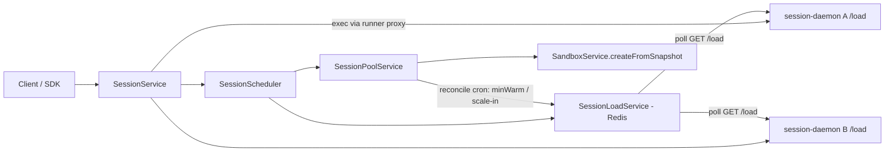
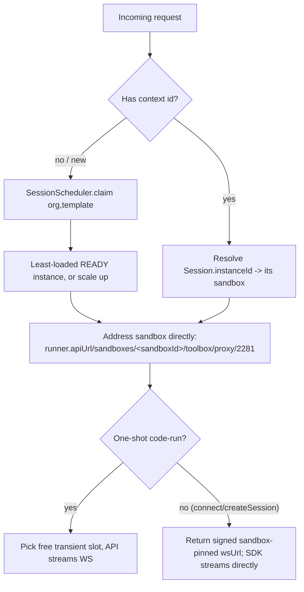

# Session Scale-Out

Hybrid-autoscaled, Redis-coordinated, cgroup-aware load distribution for session sandboxes.

This document describes the shipped behavior of the session warm-pool autoscaler. It is the
companion to the implementation in `apps/api/src/session/services/` and
`apps/session-daemon/internal/`.

## 1. Overview and goals

Originally the session pool kept **exactly one** warm sandbox (`SessionInstance`) per
`(organizationId, templateId)` and the in-sandbox daemon multiplexed every concurrent operation
onto it. Under concurrent load this serialized work and capped throughput at a single sandbox.

Scale-out replaces that invariant with a **fleet** per `(org, template)`:

- keep `minWarm` instances ready,
- route each new (context-less) operation to the **least-loaded** READY instance,
- **provision new sandboxes**, up to `maxInstancesPerTemplate`, when existing ones saturate,
- **scale in** idle `overflow` instances above `minWarm`.

**Saturation** combines two signals:

- **logical concurrency** — in-flight ops / busy daemon contexts, vs `targetConcurrencyPerSandbox`;
- **real resource pressure** — CPU/memory/disk, measured _cgroup-correctly inside the sandbox_.

The feature is backward compatible: with `minWarm=1, maxInstancesPerTemplate=1` it behaves exactly
like the previous single-instance pool, so it can ship dark and be enabled via config.

## 2. Architecture



Component responsibilities:

| Component | File | Responsibility |
|---|---|---|
| `SessionScheduler` | `services/session-scheduler.service.ts` | Pure selector: atomically claim the least-loaded instance with headroom (`claim`), or the least-loaded regardless when at cap (`claimForce`). Never provisions. |
| `SessionLoadService` | `services/session-load.service.ts` | Redis in-flight counters, transient-slot checkout, periodic `GET /load` poller + cache, `effectiveLoad`/`isSaturated`. |
| `SessionPoolService` | `services/session-pool.service.ts` | Owns the fleet lifecycle: `acquire` (claim → scale up → wait/overload), reconcile (`ensureMinWarm`, `scaleIn`, roll dead, prune ERROR). |
| session-daemon `GET /load` | `apps/session-daemon/internal/server/server.go` + `internal/loadstat` | Reports busy/active context counts, caps, and cgroup-aware CPU/mem/disk + PSI pressure. |

The **source of truth for concurrency** is the daemon's reported busy-context count (it tracks
contexts with in-flight executions). A Redis in-flight counter is an optimistic delta that bridges
the poll interval to prevent a thundering-herd onto one sandbox.

## 3. Request routing and stickiness



Key points:

- **There is no front gateway / load balancer.** The only routing decision is _instance selection
  at session/op creation_ for context-less requests.
- **Anything with a context id is sticky.** `SessionRepository.resolve` maps the context to its
  `Session.instanceId` → that instance's sandbox, and it is never rebalanced. Active `connect`
  streams are likewise pinned: the SDK gets a signed, sandbox-specific `wsUrl` and streams directly.
- **Scale-out only affects new acquisitions.** Persistent sessions created before a scale event stay
  on their original sandbox for their lifetime.

## 4. Load model

```
effectiveLoad(instance) = max(daemonBusyContexts, redisInflight)
```

- **`daemonBusyContexts`** comes from the polled `GET /load` snapshot. It is authoritative because
  it counts _all_ work on the sandbox, including SDK-direct `connect` streams that the API never
  routes a per-op request for.
- **`redisInflight`** is an optimistic counter the API `incr`s the instant it claims a slot and
  `decr`s when the op finishes. Between two `/load` polls (default 5s) the daemon snapshot is stale;
  without the in-flight delta, a simultaneous burst would all read the same "least-loaded" instance
  and stampede onto it. The counter has a safety TTL so a crashed API node can't pin an instance
  busy forever.

`SessionScheduler.claim` performs an **atomic claim**: it `incr`s the candidate's in-flight counter
and keeps the increment only if the post-increment effective load is within `targetConcurrency` and
the instance isn't under resource pressure; otherwise it releases and tries the next instance. This
atomicity is what makes a 24-way burst fan out across instances instead of all landing on one.

## 5. cgroup methodology (the `/load` resource block)

**The host-vs-cgroup pitfall:** inside a container, `/proc`, `nproc`, and `free` report the _host's_
CPU and memory, not the sandbox's allocation. The only correct, allocation-relative signals are the
cgroup files themselves plus PSI. So resource load is measured **inside the sandbox by the daemon**,
not from the API/host.

cgroup **v2** (preferred — the devbox is v2 per `docker info`):

| Metric | Source | Notes |
|---|---|---|
| CPU utilization | `cpu.stat` `usage_usec` delta ÷ (wall-time × quota) | quota from `cpu.max` (`"max"` ⇒ fall back to host nproc) |
| CPU pressure | `cpu.pressure` → `some avg10` | **primary "under load" signal** (PSI) |
| Memory utilization | `memory.current` ÷ `memory.max` | `"max"` ⇒ no signal |
| Memory pressure | `memory.pressure` → `some avg10` | PSI |
| IO pressure | `io.pressure` → `some avg10` | PSI |
| Disk utilization | `statfs(WorkspaceRoot)` used ÷ total | the sandbox's own volume |

cgroup **v1** fallback (no PSI): `cpuacct.usage` (ns) for CPU util, `memory.usage_in_bytes` ÷
`memory.limit_in_bytes` for memory util.

If neither hierarchy is readable, the daemon omits the resource sub-blocks and the API falls back to
**concurrency-only** saturation. PSI `some avg10` is preferred as the "under load" signal because it
is allocation-relative and reflects actual stall time, unlike raw utilization which can read high
while still keeping up.

The pure parsers (`ParsePSISomeAvg10`, `ParseCPUUsageUsec`, `ParseCPUMax`, `ParseMemUtil`) are
unit-tested in `apps/session-daemon/internal/loadstat/loadstat_test.go`.

## 6. Autoscale algorithm

### Scale up (in `SessionPoolService.acquire`, per request)

1. List READY instances for `(org, template)`; roll any with snapshot drift or a dead sandbox.
2. `scheduler.claim` the least-loaded instance with headroom → return it (slot claimed).
3. If all saturated and `count < maxInstancesPerTemplate`: take a short per-`(org,template)` Redis
   lock, re-check the cap, and insert a `PROVISIONING` instance row (lock released immediately so
   concurrent scale-ups can each reserve a distinct slot up to the cap). Then provision the sandbox
   and wait until READY.
4. If at cap but instances are still `PROVISIONING`: wait briefly and retry the loop so the request
   lands on freshly-ready capacity (this is what keeps a burst balanced rather than piling overflow
   onto the original sandbox).
5. If genuinely at cap with everything READY and saturated: `scheduler.claimForce` the least-loaded
   instance (graceful overload — queue behind a busy context rather than reject).

Provisioning goes through `SandboxService.createFromSnapshot`, which already enforces the org sandbox
quota, so the effective cap is `min(maxInstancesPerTemplate, quota headroom)`.

### Min-warm and scale-in (in `reconcile`, every 30s)

- **`ensureMinWarm`**: top up in-use `(org, template)` fleets to `minWarm` READY instances. With the
  default `minWarm=1`, lazy creation already maintains one warm instance, so this is a no-op unless
  `minWarm > 1`.
- **`scaleIn`**: reap `overflow` instances that are READY, have zero effective load, and have been
  idle (`lastActiveAt` older than `scaleInIdleSeconds`) — never dropping a fleet below `minWarm`,
  never reaping `warm`-role instances. Reaping rolls the instance (invalidating its sessions) and
  destroys the sandbox.
- **prune**: delete `ERROR` instance rows (and their already-invalid sessions) after a grace period.

## 7. Intra-sandbox parallelism (one-shot `code-run`)

A single transient context serializes concurrent one-shot ops on one daemon worker. `codeRun` now
checks out a free **slot** in `[0, targetConcurrencyPerSandbox)` per `(instance, language)` via Redis
and uses `transient-<instance>-<language>-<slot>` so up to `targetConcurrency` ops run on distinct
daemon contexts in parallel (reused slots pass `reset:true` to wipe globals).

When the slot pool is exhausted, the op uses a **unique ephemeral context**
(`transient-<instance>-<language>-op-<uuid>`) which is torn down afterward — never a shared slot,
because a daemon context only accepts one WS client at a time, and sharing one concurrently would
evict the other op's stream and return empty output.

## 8. Config reference

All knobs live under `session.scale` in `apps/api/src/config/configuration.ts`.

| Env var | Default | Effect |
|---|---|---|
| `SESSION_MIN_WARM` | `1` | Always-on warm instances kept ready per (org, template). |
| `SESSION_MAX_INSTANCES_PER_TEMPLATE` | `5` | Hard ceiling on instances (warm + overflow) per (org, template). |
| `SESSION_TARGET_CONCURRENCY_PER_SANDBOX` | `4` | Logical concurrency a sandbox serves before it's saturated; also the transient slot-pool size. |
| `SESSION_LOAD_POLL_MS` | `5000` | How often the load poller refreshes each instance's `/load` snapshot. |
| `SESSION_LOAD_TTL_SECONDS` | `30` | TTL on cached load snapshots / in-flight counters / slot sets (crash safety). |
| `SESSION_SCALE_IN_IDLE_SECONDS` | `600` | An overflow instance idle this long is eligible for scale-in (also ERROR-row prune grace). |
| `SESSION_CPU_PRESSURE_THRESHOLD` | `50` | CPU PSI `some avg10` (%) at/above which a sandbox is resource-saturated. |
| `SESSION_MEM_UTIL_THRESHOLD` | `0.85` | Memory utilization at/above which a sandbox is resource-saturated. |
| `SESSION_DISK_UTIL_THRESHOLD` | `0.9` | Disk utilization at/above which a sandbox is resource-saturated. |

Relevant daemon knobs (no new env needed for `/load`):

| Env var | Default | Effect |
|---|---|---|
| `SESSION_DAEMON_PY_MAX_SESSIONS` | `16` | Max Python contexts; reported as `pyMax` in `/load`. |
| `SESSION_DAEMON_TS_MAX_SESSIONS` | `64` | Max TypeScript contexts; reported as `tsMax`. |

## 9. Failure modes / ops runbook

- **Stale counters**: in-flight counters and `/load` snapshots carry a TTL (`SESSION_LOAD_TTL_SECONDS`).
  A crashed API node's optimistic increments self-heal on expiry; the daemon busy-context count
  (re-polled) re-establishes truth.
- **Sandbox roll + WS-404 self-heal**: if the pool rolls a sandbox under a stale transient memo, the
  next exec's WS handshake 404s; `codeRun` drops the memo, recreates the daemon context once, and
  retries (`isDaemonSessionNotFound`).
- **All saturated at cap**: requests are served via `claimForce` (queued behind a busy context) — they
  are slowed, not rejected. Raise `SESSION_MAX_INSTANCES_PER_TEMPLATE` (subject to org quota) if this
  is sustained.
- **`/load` unavailable** (old daemon image / unreadable cgroups): the API degrades to
  concurrency-only saturation. Scale-out still works on the in-flight + busy-context signals.
- **Inspecting load**: `GET <runner>/sandboxes/<id>/toolbox/proxy/2281/load` returns the daemon's
  live view. Redis keys: `session:load:inflight:<instanceId>`, `session:load:res:<instanceId>`,
  `session:slots:<instanceId>:<lang>`, scale-up lock `session:scale:<org>:<template>`.
- **Tuning**: lower `targetConcurrencyPerSandbox` for CPU-bound workloads (scale out sooner); raise it
  for IO-bound ones. Lower `cpuPressureThreshold` to scale out more aggressively under contention.

## 10. Testing

- Acceptance gate: `apps/daytona-e2e/sessions_scaleout_test.go` (`npx nx run daytona-e2e:e2e:scaleout`)
  — a concurrent burst must land on `>= MIN_SANDBOXES` distinct sandboxes, balanced within the max
  share, corroborated by the `daytona.io/session-template` sandbox label count.
- `apps/session-daemon/internal/loadstat/loadstat_test.go` — cgroup v2/v1 parser + collector tests.
- `apps/api/src/session/services/session-scheduler.service.spec.ts` and
  `session-load.service.spec.ts` — least-loaded claim, saturation, slot checkout, counters.
- The full `TestSession*` suite must stay green (no regression to sticky / connect / createSession).
