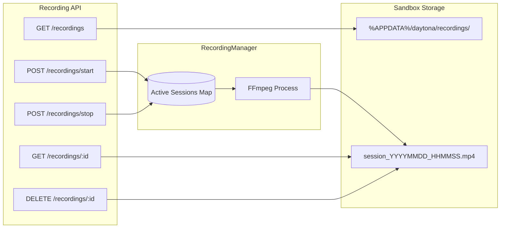

# Screen Recording Feature for daemon-win

## Overview

Add screen recording capabilities to the daemon-win API with start/stop commands. Recordings will be stored in the sandbox filesystem with timestamp-based filenames, using FFmpeg for capture.

## Architecture



## File Structure

New package: `pkg/toolbox/recording/`

| File | Purpose |
|------|---------|
| `types.go` | Request/response structs and recording session model |
| `manager.go` | RecordingManager with start/stop logic, FFmpeg process management |
| `handlers.go` | HTTP handlers with Swagger annotations |

## API Endpoints

| Method | Path | Description |
|--------|------|-------------|
| `POST` | `/recordings/start` | Start a new recording session |
| `POST` | `/recordings/stop` | Stop an active recording by ID |
| `GET` | `/recordings` | List all recordings (active + completed) |
| `GET` | `/recordings/:id` | Get recording details by ID |
| `DELETE` | `/recordings/:id` | Delete a recording file by ID |

## Key Implementation Details

### 1. Recording Manager

Singleton that tracks active recordings in a map, spawns FFmpeg processes, and manages lifecycle.

### 2. FFmpeg Command

Use `gdigrab` (Windows Desktop Duplication) for capture:

```bash
ffmpeg -f gdigrab -framerate 30 -i desktop -c:v libx264 -preset ultrafast output.mp4
```

### 3. Storage Path

- Directory: `%APPDATA%\daytona\recordings\`
- Filename format: `session_YYYYMMDD_HHMMSS.mp4`
- Example: `session_20260116_143512.mp4`

### 4. Graceful Stop

Send `q` to FFmpeg stdin for clean finalization (avoids corrupted files).

## API Request/Response Examples

### Start Recording

**Request:**

```http
POST /recordings/start
Content-Type: application/json

{
  "label": "optional-custom-label"
}
```

**Response:**

```json
{
  "id": "uuid-string",
  "fileName": "session_20260116_143512.mp4",
  "filePath": "C:\\Users\\User\\AppData\\Roaming\\daytona\\recordings\\session_20260116_143512.mp4",
  "startTime": "2026-01-16T14:35:12Z",
  "status": "recording"
}
```

### Stop Recording

**Request:**

```http
POST /recordings/stop
Content-Type: application/json

{
  "id": "uuid-string"
}
```

**Response:**

```json
{
  "id": "uuid-string",
  "filePath": "C:\\Users\\User\\AppData\\Roaming\\daytona\\recordings\\session_20260116_143512.mp4",
  "durationSeconds": 120.5,
  "status": "completed"
}
```

### List Recordings

**Request:**

```http
GET /recordings
```

**Response:**

```json
{
  "recordings": [
    {
      "id": "uuid-1",
      "fileName": "session_20260116_143512.mp4",
      "filePath": "...",
      "startTime": "2026-01-16T14:35:12Z",
      "status": "completed",
      "durationSeconds": 120.5,
      "sizeBytes": 15728640
    },
    {
      "id": "uuid-2",
      "fileName": "session_20260116_150000.mp4",
      "filePath": "...",
      "startTime": "2026-01-16T15:00:00Z",
      "status": "recording"
    }
  ]
}
```

### Delete Recording

**Request:**

```http
DELETE /recordings/:id
```

**Response:**

```
204 No Content
```

## Integration

Register routes in `toolbox.go` under `/recordings` group, following the existing pattern used for `/process/session` endpoints.

## Implementation Tasks

1. Create `pkg/toolbox/recording/types.go` with request/response structs
2. Create `pkg/toolbox/recording/manager.go` with FFmpeg process management
3. Create `pkg/toolbox/recording/handlers.go` with HTTP handlers
4. Register recording routes in `toolbox.go`
