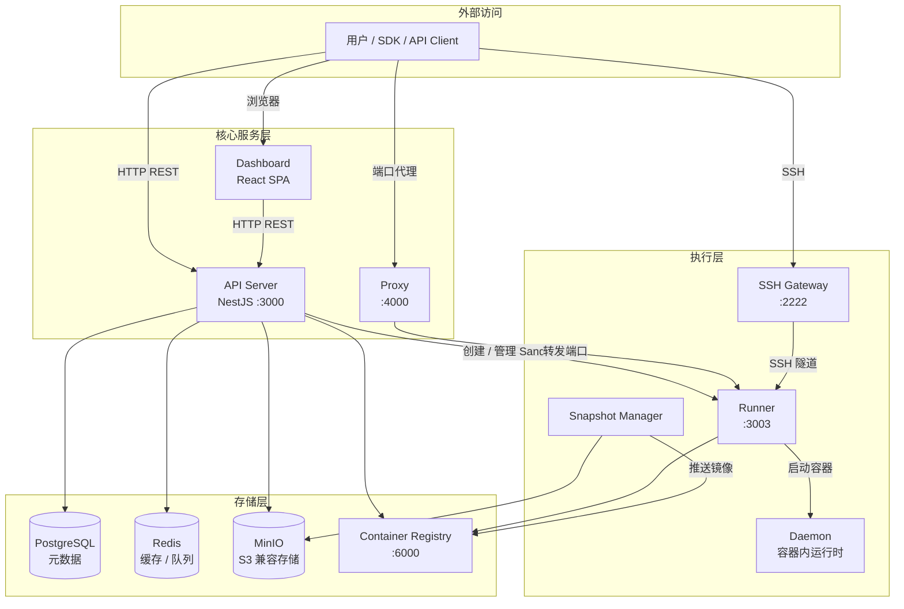
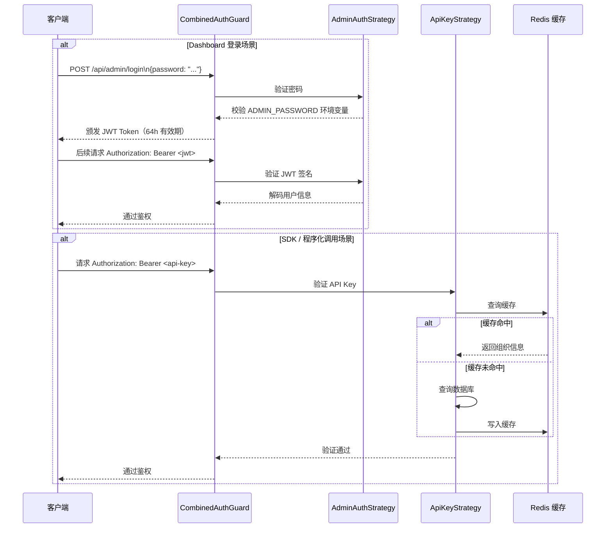
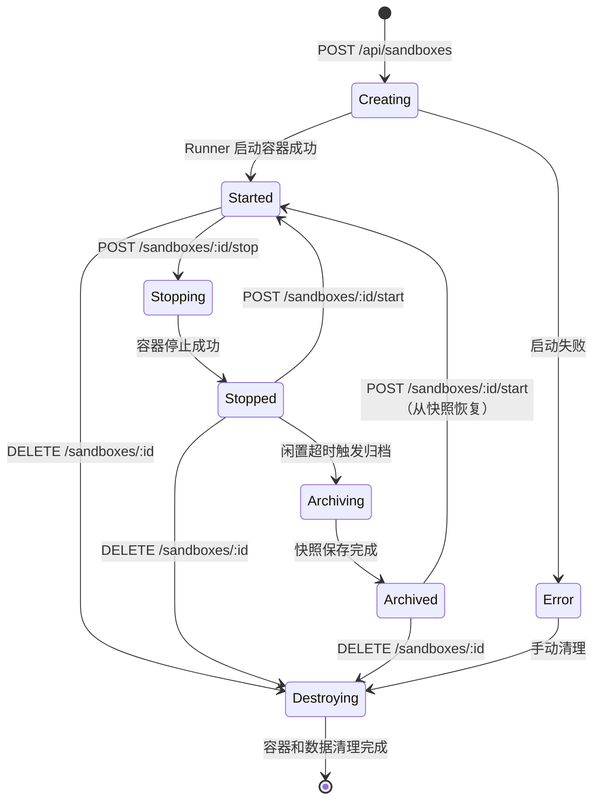
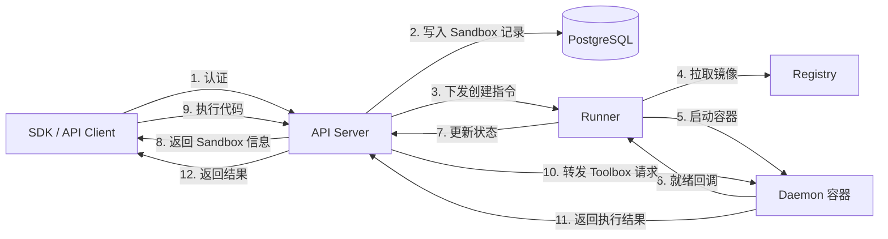
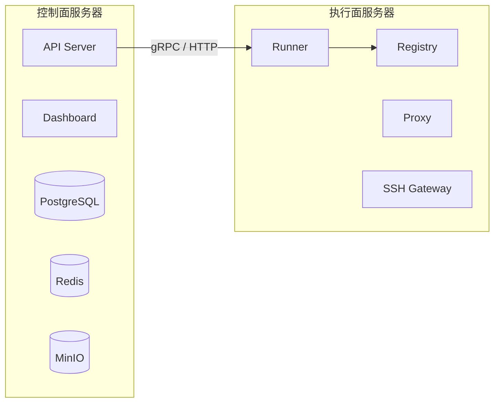

# 系统架构

Daytona Lite 是一个精简的 AI Agent 执行环境，提供安全隔离的 Sandbox 容器运行能力。

## 整体服务拓扑

## 认证流程

Daytona Lite 采用双模式认证，无需 OIDC/Dex 容器。

## Sandbox 生命周期

## 各服务职责

### API Server（`apps/api`）

基于 **NestJS** 构建的 REST API 服务，是整个系统的控制面。

| 模块 | 职责 |
|------|------|
| `AuthModule` | 双模式认证（Admin JWT + API Key），`CombinedAuthGuard` |
| `SandboxModule` | Sandbox 完整生命周期管理，Manager/Action/Runner 分层架构 |
| `OrganizationModule` | 组织管理、资源配额、权限隔离 |
| `AdminModule` | 管理员接口（Runner 注册、全局 Sandbox 管理） |
| `ApiKeyModule` | API Key CRUD，Redis 缓存加速验证 |
| `ObjectStorageModule` | MinIO S3 兼容存储操作 |
| `RegionModule` | 多区域部署支持 |

### Runner（`apps/runner`）

Sandbox 生命周期的执行层，运行在 Linux 宿主机上（需要特权模式）。

- 接收 API 下发的 Sandbox 创建/启动/停止指令
- 通过 Docker API 管理 Sandbox 容器
- 启动 Daemon 进程作为容器内运行时

### Daemon（`apps/daemon`）

运行在 Sandbox 容器内部的代理进程，提供 Toolbox API：

- **文件系统**：读写文件、目录列表
- **进程执行**：命令执行、代码运行、PTY 终端
- **Git 操作**：Clone、Commit、Branch
- **LSP 支持**：代码补全、定义跳转

### Proxy（`apps/proxy`）

将外部请求转发到 Sandbox 内部端口，支持 HTTP 和 WebSocket。访问格式：`http://<sandbox-id>-<port>.proxy.<server-ip>.nip.io`

### SSH Gateway（`apps/ssh-gateway`）

提供标准 SSH 协议接入，将 SSH 连接路由到对应的 Sandbox 容器。

## 数据流示意

## 部署拓扑

### 单机部署（推荐入门）

所有服务运行在同一台 Linux 服务器上，通过 Docker Compose 编排。适合评估和小规模使用。

### 分离部署（生产推荐）

将控制面（API、数据库）与执行面（Runner）分离，便于独立扩容执行节点。
