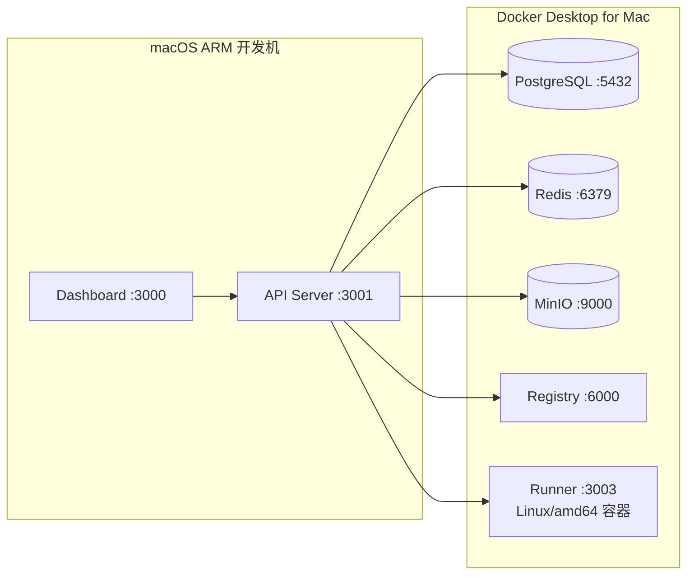
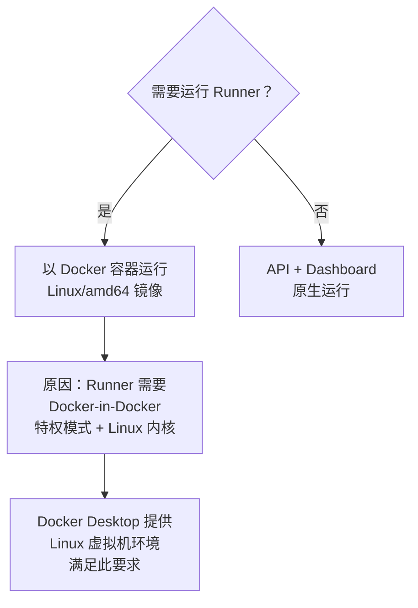
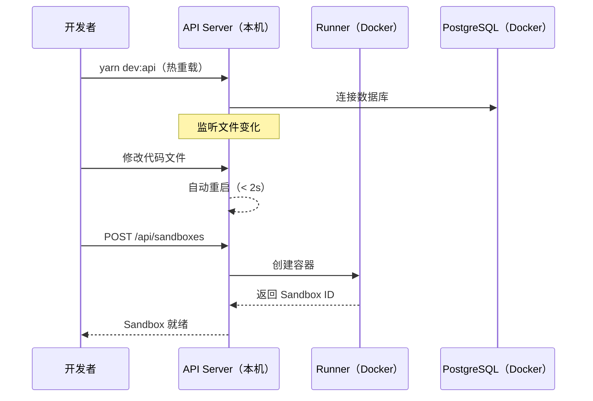

# macOS ARM 开发指南

本文档面向在 **macOS Apple Silicon（M1/M2/M3）** 上开发 Daytona Lite 的工程师。

## 环境架构



API Server 和 Dashboard 在本机原生运行，基础设施（PostgreSQL、Redis、MinIO、Registry）及 Runner 运行在 Docker Desktop 提供的 Linux 虚拟机中。

## 前置依赖

| 依赖 | 版本要求 | 用途 |
|------|---------|------|
| Docker Desktop for Mac | 4.0+ | 运行基础设施容器和 Runner |
| Node.js | 22+ | API 和 Dashboard 运行时 |
| yarn | 4.x（corepack） | 包管理器 |
| Git | 任意 | 版本控制 |
| Go | 1.21+（可选） | 仅开发 runner / ssh-gateway 时需要 |

## 分步安装

### 1. 安装 Homebrew

```bash
/bin/bash -c "$(curl -fsSL https://raw.githubusercontent.com/Homebrew/install/HEAD/install.sh)"
```

安装完成后，按照终端提示将 Homebrew 加入 PATH（Apple Silicon 路径为 `/opt/homebrew`）。

### 2. 安装 Node.js（推荐使用 fnm）

```bash
# 安装 fnm（Node 版本管理器）
brew install fnm

# 在 shell 配置文件中启用 fnm（~/.zshrc）
eval "$(fnm env --use-on-cd)"

# 重新加载 shell 配置
source ~/.zshrc

# 安装 Node.js 22
fnm install 22
fnm use 22
fnm default 22

# 验证
node --version   # 应显示 v22.x.x
```

### 3. 启用 yarn（通过 corepack）

```bash
corepack enable
yarn --version   # 应显示 4.x.x
```

### 4. 安装 Docker Desktop

从 Docker 官网下载 **Apple Silicon** 版本的 Docker Desktop for Mac 并安装。

安装完成后，在 Docker Desktop 设置中确认：
- **Resources > Memory**: 建议分配 8GB+
- **Resources > CPUs**: 建议分配 4+

### 5. 安装 Go（可选，仅开发 Go 服务时需要）

```bash
brew install go
go version   # 应显示 go1.21+
```

## 项目初始化

```bash
# 克隆项目
git clone <repository-url> daytona-lite
cd daytona-lite

# 安装所有依赖
yarn install
```

## 启动开发环境

### 方案 A（推荐）：轻量开发模式

基础设施容器化运行，API 和 Dashboard 本机运行，适合高频迭代。

```bash
# 1. 启动开发基础设施（db/redis/minio/registry/runner）
yarn dev:start

# 2. 首次开发时准备 API 配置
cp apps/api/.env.example apps/api/.env

# 3. 在新终端启动 API（热重载）
yarn dev:api

# 4. 在新终端启动 Dashboard（Vite）
yarn dev:dashboard
```

访问地址：
- Dashboard: `http://localhost:3000`
- API: `http://localhost:3001`
- Runner: `http://localhost:3003`

可选命令：

```bash
# 一键启动基础设施 + API + Dashboard
yarn dev:full

# 环境诊断 / 状态 / 日志
yarn dev:doctor
yarn dev:status
yarn dev:logs
```

### 方案 B：全容器模式（完整集成验证）

适合联调整体部署行为时使用：

```bash
docker compose -f docker/docker-compose.yaml up -d
docker compose -f docker/docker-compose.yaml ps
```

该模式会同时运行 API、Proxy、Runner、SSH Gateway、Dashboard 以及全部依赖服务。

## Runner 在 macOS 的限制



Runner 需要：
- **特权模式**（`--privileged`）：用于 Docker-in-Docker 启动 Sandbox 容器
- **Linux 内核**：依赖 Linux 命名空间和 cgroup
- **amd64 架构**（默认镜像）：多数 Sandbox 基础镜像为 amd64

macOS 本机无法满足上述条件，因此 Runner 必须以 Docker 容器运行。

## 开发工作流



### 热重载说明

- **API**（`yarn dev:api`）：NestJS `watch` 模式，文件保存后自动重新编译并重启
- **Dashboard**（`yarn dev:dashboard`）：Vite HMR，组件修改即时反映在浏览器，无需刷新

### 常用开发命令

```bash
# 运行 API 测试
npx nx test api

# TypeScript 类型检查
yarn lint:ts

# 格式化代码
yarn format

# 生成 API Client（修改 API 接口后执行）
yarn generate:api-client
```

## 辅助工具推荐

| 工具 | 用途 | 访问方式 |
|------|------|---------|
| TablePlus / Postico | PostgreSQL GUI | 连接 `localhost:5432` |
| RedisInsight | Redis 数据查看 | 连接 `localhost:6379` |
| MinIO Console | 对象存储管理 | `http://localhost:9001`（admin/minioadmin） |
| Docker Desktop Dashboard | 容器状态监控 | 系统托盘图标 |

## 构建 Linux/amd64 镜像

在 macOS ARM 上构建需要部署到 Linux x86_64 服务器的镜像，使用 `docker buildx`：

```bash
# 确保 buildx 已启用（Docker Desktop 默认已包含）
docker buildx ls

# 构建 API 镜像（指定 linux/amd64 平台）
docker buildx build \
  --platform linux/amd64 \
  -t daytona-api:latest \
  -f apps/api/Dockerfile \
  --load \
  .

# 构建并推送到镜像仓库
docker buildx build \
  --platform linux/amd64 \
  -t your-registry/daytona-api:latest \
  -f apps/api/Dockerfile \
  --push \
  .
```

> **提示**：交叉编译会使构建时间延长 2-3 倍，建议在修改稳定后再构建镜像，日常开发使用本机原生运行。

## 常见问题

**Q: `yarn install` 报错找不到 node？**

确认 fnm 已正确初始化：
```bash
fnm use 22
node --version
```

**Q: 启动 API 时报数据库连接失败？**

确认 Docker 容器正在运行：
```bash
docker compose -f docker/docker-compose.dev.yml ps
docker compose -f docker/docker-compose.dev.yml logs db
```

**Q: Runner 容器无法启动？**

检查 Docker Desktop 是否已启用特权模式支持，并查看日志：
```bash
docker compose -f docker/docker-compose.dev.yml logs runner
```

**Q: Dashboard 访问 API 报 CORS 错误？**

确认 Vite 代理配置正确（`apps/dashboard/vite.config.mts`），API 应监听在 `localhost:3001`。
