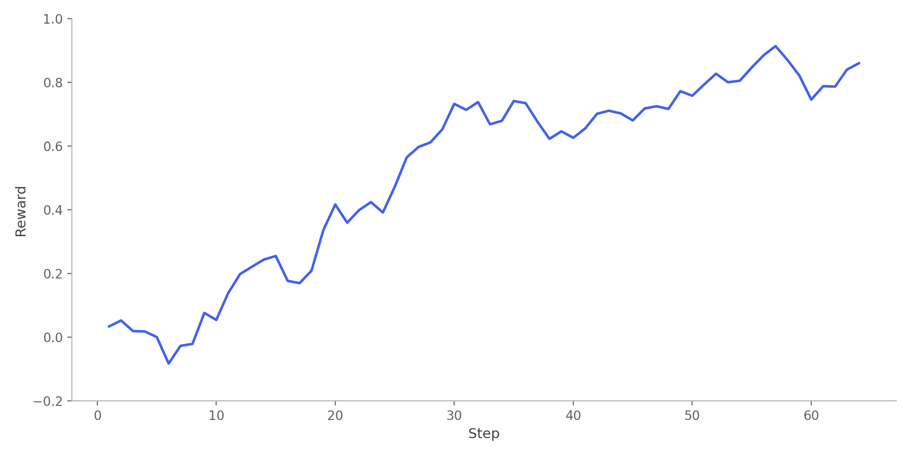

# Running RL Rollouts on Sandboxes Example (TRL + Daytona)

## Overview

This example demonstrates how to integrate Daytona with TRL in order to run code, generated in rollouts, in Daytona sandboxes. We combine TRL's synchronous trainer with parallelized, asynchronous execution in sandboxes.

In the example, GRPO is used to train `Qwen3-1.7B-Base` model on two code writing tasks: a sorting function, and a function to find the maximal contiguous subarray sum.

## Features

- **Sandboxed code execution:** Generated code runs in isolated Daytona sandboxes, preventing harmful code from affecting your system
- **Parallel evaluation:** Multiple completions are evaluated concurrently across a pool of sandboxes
- **Test-based rewards:** Reward signal uses the test pass rate
- **vLLM integration:** Uses vLLM in colocate mode for running both training and generation on 1 GPU
- **Multi-task training:** Easily extensible to new coding tasks by adding to the `TASKS` dictionary

## Requirements

- **Python:** Version 3.10 or higher
- **GPU:** Required for training and vLLM inference, 60 GB VRAM or more recommended

## Environment Variables

- `DAYTONA_API_KEY`: Required for access to Daytona sandboxes. Get it from [Daytona Dashboard](https://app.daytona.io/dashboard/keys)

## Getting Started

### Setup and Run

1. Install uv (skip if already installed):

   ```bash
   curl -LsSf https://astral.sh/uv/install.sh | sh
   ```

2. Install dependencies:

   ```bash
   uv sync
   ```

3. Set your Daytona API key in `.env` (copy from `.env.example`):

   ```bash
   cp .env.example .env
   # edit .env with your API key
   ```

4. Run the training:

   ```bash
   uv run python train.py
   ```

## Configuration

The script has several configurable parameters:

### Sandbox Settings

- `SANDBOX_POOL_SIZE`: Number of Daytona sandboxes to create (default: 10).
- `MAX_TIMEOUT_SECONDS`: Timeout for code execution in each sandbox (default: 1 second). Prevents infinite loops from blocking training.

### Model Settings

- `MODEL_NAME`: The base model to train (default: `Qwen/Qwen3-1.7B-Base`)

### Training Settings (GRPOConfig)

Key parameters in the training configuration:

- `num_generations`: Number of completions to generate per prompt (default: 5)
- `max_completion_length`: Maximum tokens for generated code (default: 512)
- `max_steps`: Total training steps (default: 64)

### Adding New Tasks

To add a new coding task, add an entry to the `TASKS` dictionary:

```python
TASKS = {
    "your_task": {
        "prompt": "Your prompt here...",
        "func_name": "function_name",
        "banned_patterns": ["patterns", "to", "ban"],
        "tests": [
            "test_input_1",
            "test_input_2",
        ],
        "reference": "expected_output_expression",
    },
}
```

## How It Works

GRPO learns by generating multiple solutions per problem and reinforcing those that perform best:

1. **Sandbox pool:** Daytona sandboxes are created upfront for safe, parallel code execution
2. **Generation:** The model generates N completions per prompt via vLLM
3. **Sanitization:** Completions using banned patterns (e.g., using built-in functions) are rejected
4. **Evaluation:** Each completion runs in a Daytona sandbox against the test suite
5. **Reward:** -1 for errors or banned patterns; otherwise, the rewards is the fraction of tests passed
6. **Policy update:** GRPO reinforces completions that scored higher than their group average
7. **Cleanup:** When training finishes, sandboxes are deleted

## Output

After training finishes, the trained model is saved in `training_results` folder. The metrics computed during the training run can be found in `training_results/metrics.jsonl`.

Below is a plot showing average rewards over the training steps:




## License

See the main project LICENSE file for details.

## References

- [TRL (Transformer Reinforcement Learning)](https://huggingface.co/docs/trl/)
- [Daytona](https://daytona.io)
- [vLLM](https://docs.vllm.ai/)
