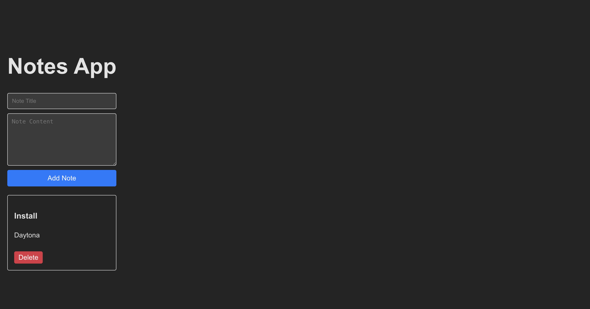

# Coding Agent Example (AgentKit + Daytona)

## Overview

This project demonstrates a fully autonomous coding agent capable of performing software development tasks in a [Daytona](https://daytona.io) sandbox environment. The agent is built using [AgentKit](https://agentkit.inngest.com/) and leverages Daytona sandboxes for secure, isolated execution. The agent can create simple web apps, run tests, execute scripts, and more - all by reasoning about the user's request and automating the necessary steps.

## Features

- **Multi-language support:** The agent can use any language supported by Daytona sandboxes
- **Web app creation:** Automatically scaffolds and builds simple web applications.
- **Dev server orchestration:** Detects when a development server is needed, starts it, and generates a preview link for live app inspection.
- **File and directory management:** Creates, uploads, reads, and deletes files and directories as needed.
- **Script and test execution:** Runs arbitrary scripts and test suites.
- **Automated reasoning:** Plans and executes multi-step development workflows based on user prompts.
- **Debug logging:** Detailed agent flow tracking enabled via `enableDebugLogs=true`.

## Requirements

- **Node.js:** Version 18 or higher is required.

## Environment Variables

To run the coding agent, you need to set the following environment variables:

- `DAYTONA_API_KEY`: Required for access to Daytona sandboxes. Get it from [Daytona Dashboard](https://app.daytona.io/dashboard/keys)
- `ANTHROPIC_API_KEY`: Because Anthropic is the default model provider, you must set `ANTHROPIC_API_KEY` in your environment. By default the agent uses `claude-3-5-haiku-20241022` model with a preset token limit.

> [!Note]
> You can change the token setting and the model (see all available Anthropic models at [AgentKit Supported Models](https://agentkit.inngest.com/concepts/models#list-of-supported-models)). To use a different model provider, follow the instructions at [AgentKit Model Setup](https://agentkit.inngest.com/concepts/models#create-a-model-instance).

See the `.env.example` file for the exact structure and variable names. Copy `.env.example` to `.env` and fill in your API keys before running the agent.

## Getting Started

Before proceeding with either Local or Docker setup, complete the following steps:

1. Navigate to this directory in your terminal
2. Copy `.env.example` to `.env` and add your API keys

### 1. Local Setup

1. Install dependencies:

   ```bash
   npm install
   ```

2. Run the agent:

   ```bash
   npm run start
   ```

### 2. Docker Setup

1. Build the Docker image:

   ```bash
   docker buildx build . -t coding-agent
   ```

2. Run the container:

   ```bash
   docker run --rm -it coding-agent
   ```

## Configuration

- **Prompt Setting:** The main prompt for the agent is configured in the `network.run(...)` call inside [`src/index.ts`](src/index.ts). You can edit this prompt to change the agent's task or try different app ideas and workflows.

- **Debug Logs:** Detailed agent flow tracking is enabled by setting `enableDebugLogs=true`. This will log all agent iterations and tool actions for transparency and troubleshooting.

## Example Usage

To showcase the agent, try running the default prompt in `src/index.ts`:

```typescript
const result = await network.run(
  `Create a minimal React app called "Notes" that lets users add, view, and delete notes. Each note should have a title and content. Use Create React App or Vite for setup. Include a simple UI with a form to add notes and a list to display them.`
);
```

The agent will:

- Scaffold the app
- Install dependencies
- Start the dev server
- Generate a preview link for you to view the app

You can inspect the terminal logs to monitor what the agent is doing, observe its evolution, and see how it corrects mistakes from errors during the process.

When the agent finishes, you should see terminal output like:

> ✔️ App is ready!
> Preview: https://5173-3a828150-1573-42e3-bf9f-9793a2c2c0c2.proxy.daytona.works

You can view the app on the given preview link above. The image below shows the result generated in this run:



## License

See the main project LICENSE file for details.

## References

- [AgentKit](https://agentkit.inngest.com/)
- [Daytona](https://daytona.io)
